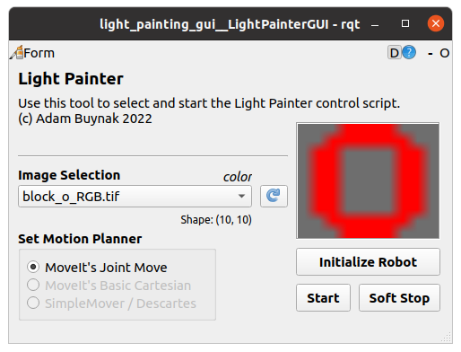

# Light Painting RQT Plugin

This package provides an RQT plugin as a GUI tool to interact with the Light Painting Program.


### Usage

Open tool using either the RQT dropdown menu or run the below command to open the tool alone.
```bash
rqt --standalone light_painting_gui
```

## Tool Overview



